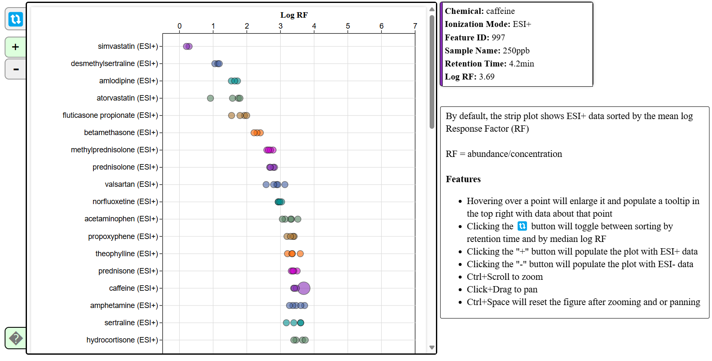

# INTERPRET NTA qNTA Strip Plots

**Author:** E. Tyler Carr

This interactive plot is a part of the INTERPRET NTA qNTA suite of visualizations. It is a strip plot of the log response factor (RF) for each chemical in a dataset, which is particularly useful for determining outliers.

$$
\text{RF} = \frac{\text{abundance}}{\text{concentration}}
$$

## Dependencies

This project requires the following libraries:

- [D3.js](https://d3js.org/) (version 7)
- [SheetJS (xlsx)](https://sheetjs.com/) (version 0.17.0)

## Functionality

By default, the strip plot is ordered by median log(RF). A help tooltip button exists at the bottom left of the plot that can be toggled on and off by clicking.

### On-Hovers and Toggling ESI+ and ESI- Mode

Hovering over a node will populate a tooltip in the topright with data about that point. Notice that each chemical is mapped to one of 7 unique colors, when hovering over a node the vertical bar on the left side of the tooltip will change to color of the hovered node.

Clicking the "+" and "-" buttons on the left side of the plot will toggle between viewing the ESI+ and ESI- mode data, respectively.

### Sorting

Sorting by chemical name or by median log(RF) (default) can be toggled by clicking the button in the top left.

